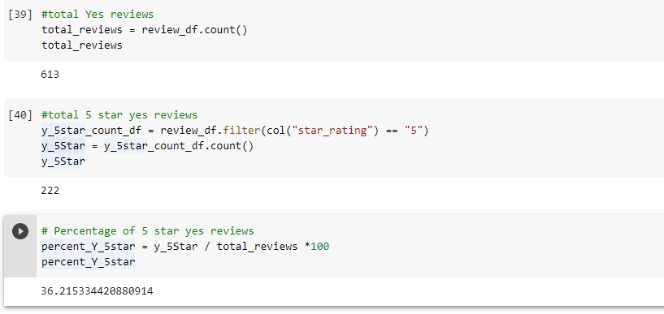
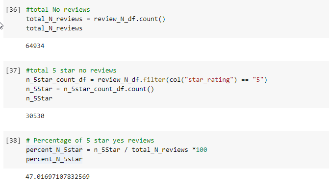

# Amazon_Vine_Analysis

## Overview
This Analysis is being done to determine if there is any bias towards reviews that were written as part of the Vine program.

## Results
-	There was a total of 613 Vine paid reviews and total of 64934 Vine Nonpaid reviews
-	There were a 222 5-star Vine reviews and 30530 5-Star non-Vine Reviews
-	There were 36.21% of 5-Star Vine reviews and 47.01% of 
-	

## Summary
-	The Results of the paid and unpaid reviews shows that there is no bias towards positivity of the paid reviews. There is a higher percent of 5-Star ratings in the unpaid reviews.
-	A deeper dive in the analysis will be to compare the rating against the helpful votes to understand if the paid Vine reviews had any bias towards a positive review. Comparing the percentages will give a clear picture.
